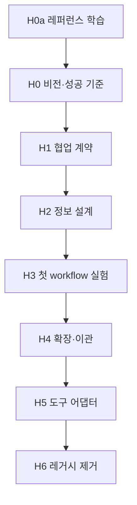

# AI 하네스 공동 제작 — 마일스톤

> 이 문서는 **하네스를 쓰는** 마일스톤이 아니라, **하네스를 함께 만드는** 마일스톤이다.  
> wishlist PRD의 M1→M5처럼, 각 단계마다 **완료 정의·포함·미포함**을 먼저 고정하고 넘어간다.

## 진행 원칙

1. **한 번에 한 마일스톤** — 다음 단계 파일/규칙 작성은 현재 M의 완료 정의를 만족한 뒤.
2. **레퍼런스는 도구가 아님** — Superpowers / OMX / gstack / BMAD / 기존 plan-before-code는 *재료*일 뿐, 벤더링·설치 목표가 아님.
3. **설계 전 학습** — [`references.md`](./references.md)로 키워드·프레임워크를 문서화한 뒤, H0–H1에서 차용 여부를 ADR로 고른다.
4. **실전에서 검증** — 이론으로 workflow를 5개 쓰지 않고, **실제 Souzip 작업 1건**으로 마일스톤마다 마찰을 기록한다.
5. **결정은 ADR로** — `decisions.md`에 “왜 이렇게 했는지”만 남기고, plan.md는 그 시점의 실행 스냅샷.

## 마일스톤 맵

| ID | 이름 | 완료하면 | 산출물 (함께 채움) |
|----|------|----------|-------------------|
| **H0a** | 레퍼런스 학습 | 키워드·프레임워크를 읽고 차용/기각 초안 | [`references.md`](./references.md), `decisions.md` 메모 |
| **H0** | 비전·경계 | “이 하네스가 해결하는 문제”가 1페이지로 말 가능 | `vision.md` |
| **H1** | 협업 계약 | 나↔AI 역할·게이트·트리거가 합의됨 | `vision.md` §계약, `decisions.md` |
| **H2** | 정보 설계 | 규칙/절차/맥락/산출물 4층과 디렉터리 **이름** 확정 | `decisions.md`, 구조 초안 |
| **H3** | 첫 workflow | **하나**의 단계만 문서화하고 실제 기능 1건에 적용 | `workflows/{첫단계}.md`, 마찰 로그 |
| **H4** | 확장·이관 | 나머지 단계 + CLAUDE/context 이관 (삭제 전) | `harness/` 골격, 이관 매핑 |
| **H5** | 도구 어댑터 | Cursor에서 자동으로 게이트가 걸림 | `.cursor/rules`, `.cursor/skills` |
| **H6** | 레거시 제거 | `.claude/`, `docs/claude/`, `CLAUDE.md` 제거 | grep 0, README 갱신 |

---

## H0a — 레퍼런스 학습 (설계 전)

**완료 정의**

- [x] §4 차용 결정 **5건** → `decisions.md` ADR-006~010 (2026-05-19)
- [x] `vision.md` §비목표·§예외·5모드 초안 반영
- [ ] [`references.md`](./references.md) §0–§3 정독 (H0 병행해도 됨)
- [ ] §5 로드맵 1–3번 (여유 시)

**포함**

- 이 문서 확장 (새 키워드 들으면 §6 색인에 추가)

**미포함**

- `harness/` 디렉터리 생성
- workflow 파일 작성

---

## H0 — 비전·경계

**완료 정의**

- [x] `vision.md` §문제: 고통 3건 (상황→기대→실제→왜)
- [x] `vision.md` §성공: 관찰 가능 기준 4개 + plan 가독성은 H3 목표로 분리
- [x] `vision.md` §비목표 3줄
- [x] `decisions.md` ADR-001 Accepted

**포함**

- 개인/팀 사용 가정 (1인 vs 나중에 팀)
- 주 사용 도구 (현재 Cursor, 미래 가능성)

**미포함**

- 디렉터리 트리 확정
- workflow 파일 작성
- 레포 파일 삭제

---

## H1 — 협업 계약

**완료 정의**

- [x] 5모드: intake → plan → implement → verify → ship (ADR-007)
- [x] 게이트 G1~G5 — [`triggers.md`](./triggers.md) §2
- [x] 트리거 표 + plan-before-code·create-pr 매핑 — `triggers.md` §3
- [x] Quick Flow 예외 — `triggers.md` §4
- [x] ADR-002 (스킬 흡수), ADR-011 (주도권·게이트)

**포함**

- 기존 `plan-before-code` 유지·변경·폐기 판단

**미포함**

- intake 필수 여부 (H3 실험 후 결정 가능)
- TDD 강제 여부

---

## H2 — 정보 설계

**완료 정의**

- [x] 4층 모델 — [`harness/README.md`](../../harness/README.md)
- [x] 항상 vs 필요 시 로드 정책 — 동일
- [x] `docs/plans/` vs `docs/harness/scratch/` — plans 추적, scratch만 ignore (ADR-013)
- [x] ADR-003 — `AGENTS.md` + `docs/harness/`
- [x] 이관 맵 — [`docs/harness/migration-map.md`](../../harness/migration-map.md)

**포함**

- wishlist `plan.md` 포맷(Before/After)을 artifact로 유지할지 검토

**미포함**

- `.mdc` / SKILL.md 실제 작성

---

## H3 — 첫 workflow 실험 (가장 중요)

**완료 정의**

- [ ] **단 하나**의 workflow를 선택해 문서화 (추천 후보: `plan` — 이미 익숙)
- [ ] Souzip **실제 작업 1건**에 적용 (새 기능·리팩터·문서-only 중 택1)
- [ ] `friction-log.md`에 마찰 5줄 이상: “에이전트가 어긋난 순간 / 문서에 없어서 헷갈린 것”
- [ ] 실험 후 workflow 1회 개정
- [ ] `decisions.md` ADR-004: 두 번째 workflow 추가 여부·순서

**포함**

- dogfood만, `harness/` 전체 트리는 아직 없어도 됨 (임시 경로 `docs/plans/agent-harness-rebuild/experiments/` 허용)

**미포함**

- 5개 workflow 일괄 작성
- 레거시 삭제

---

## H4 — 확장·이관

**완료 정의**

- [ ] H3에서 검증된 패턴으로 나머지 단계 문서화 (개수는 H1 계약 따름)
- [ ] `harness/context/*`에 architecture·layers 이관
- [ ] `constitution.md`에 DO NOT·Git
- [ ] `AGENTS.md` 50줄 이내 초안
- [ ] guides (base-view 등) 필요 시만 추가 — YAGNI

**미포함**

- `.cursor/` (H5)

---

## H5 — Cursor 어댑터

**완료 정의**

- [x] `alwaysApply` — `.cursor/rules/00-souzip-harness.mdc` (ADR-012, 2026-05-19)
- [x] 5모드 + 라우터 스킬 — `.cursor/skills/souzip-*` (triggers.md §8)
- [ ] glob 규칙: Swift / Projects 레이어 (중복 최소)
- [ ] 새 채팅 2회 smoke: plan 게이트 / 구현 트리거

---

## H6 — 레거시 제거

**완료 정의**

- [ ] `CLAUDE.md`, `.claude/`, `docs/claude/` 삭제
- [ ] 링크 grep 수정
- [ ] `plan.md`(이 프로그램)에 최종 구조 스냅샷

---

## 현재 상태

| 마일스톤 | 상태 | 비고 |
|----------|------|------|
| H0a | **완료** | ADR-006~010 (2026-05-19) |
| H0 | **완료** | vision.md 확정 (2026-05-19) |
| H1 | **완료** | triggers.md (2026-05-19) |
| H2 | **완료** | docs/harness/ + AGENTS.md (ADR-013, 2026-05) |
| H3 | **다음** | plan workflow dogfood |
| H4–H6 | 대기 | |

## 관련 문서

| 문서 | 용도 |
|------|------|
| [`references.md`](./references.md) | BMAD·SP·OMX·gstack·소크라테스·PRD·ADR 레퍼런스 북 |
| [`vision.md`](./vision.md) | H0–H1 공동 작성본 |
| [`decisions.md`](./decisions.md) | ADR 로그 |
| [`triggers.md`](./triggers.md) | H1 트리거·게이트 정본 |
| [`friction-log.md`](./friction-log.md) | H3+ 실험 마찰 |
| [`plan.md`](./plan.md) | 초기 리서치·참고안 (H2 이후 스냅샷 갱신) |
