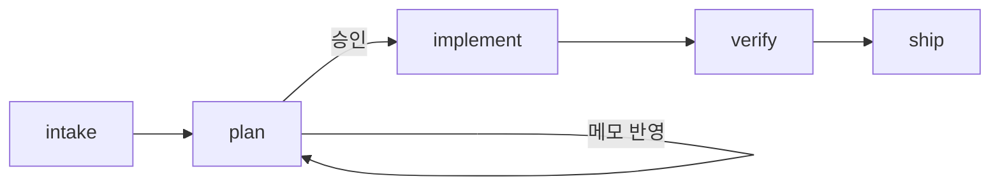

# AI 하네스 재설계 — 리서치 및 참고안

> **Jira**: [SOU-637](https://souzip.atlassian.net/browse/SOU-637)

> **모드 변경 (2026-05-19)**  
> 이 문서는 “일괄 구현 청사진”이 아니라 **참고 리서치**다.  
> 진행 순서·완료 기준은 [`milestones.md`](./milestones.md) · 공동 작성은 [`vision.md`](./vision.md) 를 따른다.  
> **H0이 끝나기 전에는 `harness/` 디렉터리를 만들지 않는다.**

## 목표 (장기 — H6에서 달성)

- **도구 중립**: Cursor를 쓰되, 다른 에이전트도 같은 규약을 읽을 수 있게.
- **직접 설계**: Superpowers / OMX / gstack은 **재료**일 뿐, 설치·복제가 목표가 아님.
- **이관 후 삭제**: 레거시는 H4–H6에서, **합의된 구조가 실전 검증된 뒤** 제거.

---

## 파악한 구조 (현재)

| 위치 | 역할 | 문제 |
|------|------|------|
| `CLAUDE.md` | 진입점 + 규칙 + 워크플로 + 기능 절차 전부 | Claude 전용 이름, 한 파일에 과밀 |
| `docs/claude/architecture.md` | 아키텍처 상세 | `claude` 네이밍, 진입점과 분리되어 있으나 링크가 CLAUDE 전용 |
| `docs/claude/module-layer-constitution.md` | 레이어 규범 | 동일 |
| `.claude/skills/` | plan-before-code, create-pr, base-view-guide | Cursor 표준(`.cursor/skills`)과 이중 구조 |
| `docs/plans/{feature}/plan.md` | 작업별 플랜 산출물 | **유지** — 이미 좋은 패턴 |
| `.cursor/rules/` | 없음 | Cursor는 workspace rule로 CLAUDE.md만 주입 중 |

### 참고 하네스에서 가져올 핵심

| 출처 | 가져올 것 | Souzip에 안 가져올 것 |
|------|-----------|------------------------|
| **Superpowers** | 코드 전 brainstorm → 설계 승인 → 세분 플랜 → 구현; 플랜 승인 전 구현 금지; 단계별 스킬 | TDD 강제( iOS/UI 위주, 테스트 문화 별도 협의 시), 2–5분 태스크 단위까지 쪼개기(과도) |
| **oh-my-codex** | `.omx/` 같은 **상태 디렉터리** 개념, interview → plan → execute 파이프 | 30+ 에이전트, MCP 상태 서버, Codex 전용 CLI |
| **gstack** | **역할 전환**(기획/엔지/리뷰/릴리즈), `/ship` 같은 명시적 종료 단계 | 23개 슬래시 커맨드 전부, Browse daemon, iOS 비관련 QA 브라우저 |

---

## 제안 아키텍처: `harness/` + `AGENTS.md`

도구별 어댑터는 얇게, **진짜 내용은 `harness/` 한곳**에 둔다.

```
Souzip/
├── AGENTS.md                 # 모든 에이전트 공통 진입 (짧게, 링크만)
├── harness/
│   ├── README.md             # 하네스 사용법, 단계 다이어그램
│   ├── constitution.md       # 비협상 규칙 (DO NOT, Git, 언어)
│   ├── context/
│   │   ├── project.md        # 개요, Tuist, 빌드
│   │   ├── architecture.md   # docs/claude/architecture.md 이관
│   │   └── layers.md         # module-layer-constitution 이관
│   ├── workflows/            # 단계별 절차 (구 .claude/skills + superpowers 단계)
│   │   ├── 00-triggers.md    # 사용자 한국어 트리거 표
│   │   ├── 01-intake.md      # 요구 정제 (brainstorm / deep-interview 축소)
│   │   ├── 02-plan.md        # plan-before-code (Before/After plan.md)
│   │   ├── 03-implement.md   # 승인 후 구현, 플랜 체크박스
│   │   ├── 04-verify.md      # 자가 리뷰, 레이어/import 점검
│   │   ├── 05-ship.md        # 커밋·PR (create-pr 이관)
│   │   └── guides/
│   │       └── base-view.md  # base-view-guide 이관
│   └── state/                # .gitignore — 세션 메모 (OMX .omx/ 축소판)
│       └── .gitkeep
├── docs/plans/{feature}/plan.md   # 유지 (작업 산출물)
├── .cursor/
│   ├── rules/                # constitution 요약 + workflow 게이트
│   │   ├── 00-harness.mdc    # alwaysApply: AGENTS/harness 진입, 플랜 게이트
│   │   ├── 10-ios-core.mdc   # globs: **/*.swift — 금지·컨벤션
│   │   └── 20-feature-layers.mdc  # globs: Projects/** — 레이어 규범 요약
│   └── skills/               # Cursor용 — 본문은 harness/workflows 링크
│       ├── intake/SKILL.md
│       ├── plan/SKILL.md
│       ├── implement/SKILL.md
│       ├── verify/SKILL.md
│       └── ship/SKILL.md
```

### `AGENTS.md` 역할 (50줄 이내 목표)

1. 프로젝트 한 줄 소개
2. **반드시 읽을 순서**: `harness/README.md` → 작업 시 `harness/workflows/00-triggers.md`
3. 비협상: `harness/constitution.md` 요약 5줄
4. 상세는 `harness/context/`로 위임
5. 플랜 산출: `docs/plans/`
6. (선택) Cursor 사용자: `.cursor/rules/` 자동 적용됨

다른 도구는 `AGENTS.md`만 읽어도 동작. Claude Code는 예전처럼 `CLAUDE.md` 대신 동일 파일을 symlink하거나, 이관 기간만 `CLAUDE.md`에 “내용은 AGENTS.md 참조” 한 줄.

---

## 워크플로 (Souzip版 파이프라인)



### 단계 정의

| 단계 | 파일 | Superpowers | OMX | GStack | 사용자 트리거 (예) |
|------|------|-------------|-----|--------|-------------------|
| **intake** | `01-intake.md` | brainstorming | deep-interview | office-hours | 기능 요청, “이거 만들고 싶어” |
| **plan** | `02-plan.md` | writing-plans | ralplan | plan-eng-review | (intake 후 자동), “플랜만” |
| **implement** | `03-implement.md` | executing-plans | ralph | (autoplan 구현부) | **“구현해”**, “구현 시작해” |
| **verify** | `04-verify.md` | requesting-code-review | reviewer | review | “리뷰해”, “검증해” |
| **ship** | `05-ship.md` | finishing-branch | — | ship | “PR 만들어줘”, “커밋해” (명시 시만) |

### 게이트 (기존 plan-before-code 유지·강화)

- **플랜 승인 전 코드 변경 금지** — `00-harness.mdc` + `02-plan.md`에 명시
- **intake**에서 범위·수용 기준·비목표를 `docs/plans/{feature}/plan.md` 상단에 기록
- **plan**은 기존 Before/After 포맷 유지
- **implement**는 승인된 plan.md만 source of truth
- 방향 틀리면 패치 누적 금지 → git revert 후 plan 재작성 (기존 정책 유지)

### iOS/Tuist 특화 (gstack 역할 축소)

전용 “슬래시 23개” 대신 **verify** 단계 체크리스트:

- Presentation → Data import 없음
- Domain 외부 의존 없음
- `force_unwrapping` / Combine 없음
- 새 피처 시 Factory 체인 5단계 (`context/project.md`에 링크)

---

## 이관 매핑

| 삭제 대상 | 이관 위치 |
|-----------|-----------|
| `CLAUDE.md` §개요·빌드 | `harness/context/project.md` |
| `CLAUDE.md` §금지·컨벤션·Git | `harness/constitution.md` + `.cursor/rules/10-ios-core.mdc` |
| `CLAUDE.md` §새 기능 절차 | `harness/context/project.md` § Feature checklist |
| `CLAUDE.md` §AI 워크플로 | `harness/workflows/02-plan.md` + `00-triggers.md` |
| `docs/claude/architecture.md` | `harness/context/architecture.md` |
| `docs/claude/module-layer-constitution.md` | `harness/context/layers.md` |
| `.claude/skills/plan-before-code` | `harness/workflows/02-plan.md` |
| `.claude/skills/create-pr` | `harness/workflows/05-ship.md` |
| `.claude/skills/base-view-guide` | `harness/workflows/guides/base-view.md` |

**유지**: `docs/plans/**` (경로·포맷 변경 없음)

---

## 구현 단계 (승인 후 순서)

### Phase 1 — 골격 (삭제 없음)

1. `harness/` 디렉터리 트리 + `AGENTS.md` 초안
2. `harness/context/*` 이관 (복사·헤더에서 CLAUDE 참조 제거)
3. `harness/constitution.md` 작성
4. `harness/workflows/*` 작성 (`00-triggers` ~ `05-ship`, guides)
5. `harness/README.md` + `harness/state/.gitignore`

### Phase 2 — Cursor 어댑터

6. `.cursor/rules/00-harness.mdc`, `10-ios-core.mdc`, `20-feature-layers.mdc`
7. `.cursor/skills/*/SKILL.md` — 각각 `harness/workflows/...` 로드 지시 (`disable-model-invocation: false`는 workflow 스킬만 검토)

### Phase 3 — 이관 완료·삭제

8. 루트 `CLAUDE.md` → `AGENTS.md`만 남기거나 삭제 (선택: 1주 redirect 파일)
9. `docs/claude/` 삭제
10. `.claude/` 삭제
11. README/기존 링크 grep 후 `harness/`로 수정

### Phase 4 — 검증

12. Cursor 새 채팅에서: “위시리스트 UI M4 플랜만 검토” → plan 게이트 동작
13. “구현해” 없이 코드 안 쓰는지 확인
14. 다른 도구 시뮬: `AGENTS.md` + `harness/workflows/02-plan.md`만 붙여 넣었을 때 동일 행동 기술 가능한지 자가 점검

---

## `00-triggers.md` 초안 (워크플로 일부)

| 사용자 지시 | 에이전트 행동 | 산출물 |
|-------------|---------------|--------|
| 기능/버그 요청 (규모 큼) | intake → plan 작성, **대기** | `docs/plans/{feature}/plan.md` |
| “메모 반영해서 업데이트해” | plan.md만 수정 | 동일 |
| “구현해” / “구현 시작해” | `03-implement.md` | 코드 + plan 체크 |
| “리뷰해” | `04-verify.md` | 리뷰 노트 (코드 변경 최소) |
| “PR 만들어줘” | `05-ship.md` | PR (사용자 규칙·gh) |
| 오타·한 줄 수정 | 워크플로 생략 가능 | — |

`{feature}` 네이밍: 기존과 동일 (`wishlist-ui-m4` ✅, `refactor` ❌).

---

## 의도적으로 하지 않는 것 (YAGNI)

- 외부 플러그인(Superpowers/OMX/gstack) **벤더링/설치** — 패턴만 차용
- `harness/state`에 MCP 서버
- 멀티 에이전트 병렬($team) — 필요 시 나중에 `workflows/optional-parallel.md`
- TDD 스킬 강제 — iOS에서 테스트 전략 별도 합의 후 추가
- `docs/plans` 구조 변경

---

## 리스크

| 리스크 | 완화 |
|--------|------|
| Cursor가 예전 CLAUDE.md만 보도록 캐시 | Phase 3에서 workspace rule이 `AGENTS.md`/`harness` 가리키게 |
| 규칙 중복 (mdc vs constitution) | mdc는 50줄 이하 요약 + “상세: harness/…” |
| 팀원이 경로 모름 | `AGENTS.md` + README 한 줄 |

---

## 승인 시 첫 커밋 메시지 (참고)

```
chore: AI 하네스 harness/ 구조 도입 및 CLAUDE 이관
```

(Phase 3 삭제는 동일 PR 또는 follow-up `chore: 레거시 claude 하네스 제거`)

---

## 다음 액션 (공동 제작)

| 순서 | 할 일 | 담당 |
|------|--------|------|
| 1 | [`vision.md`](./vision.md) §문제 — 고통 3건 작성 | **당신** (이번 턴 가능) |
| 2 | §성공·§비목표 보완 | 함께 |
| 3 | H0 체크리스트 완료 → H1 협업 계약 | 함께 |
| 4 | H3에서 workflow 1개만 실험 | 함께 |

**지금 하지 않음**: `harness/` 생성, `.cursor/rules`, 레거시 삭제, 5단계 workflow 일괄 작성.

---

## (보류) 확인이 필요했던 결정 → H1–H2로 이관

디렉터리 이름, TDD, intake 필수, CLAUDE 잔존 — `decisions.md` ADR-001~003에서 확정.
