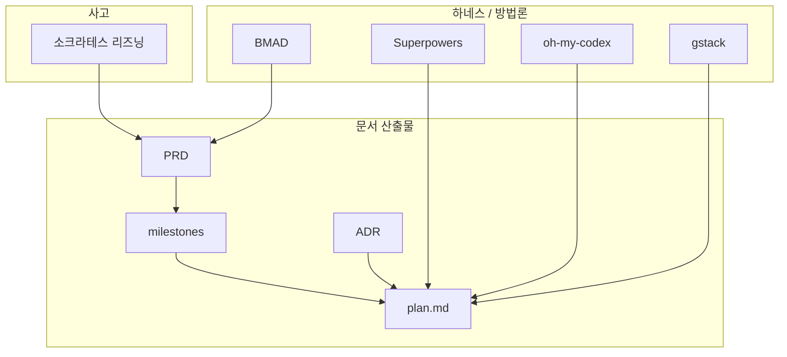

# AI 협업 레퍼런스 북 (Souzip 하네스용)

> **목적**: BMAD, Superpowers, OMX, gstack, 소크라테스 리즈닝, PRD, ADR 등 들어본 키워드를 **한곳에 학습·정리**하고,  
> 하네스(H0–H6)를 설계할 때 **무엇을 차용·무엇을 버릴지** 판단하는 근거로 쓴다.  
> **이 문서는 외부 도구 설치 가이드가 아니다.**

**최종 갱신**: 2026-05-19  
**관련**: [`milestones.md`](./milestones.md) · [`vision.md`](./vision.md) · [`decisions.md`](./decisions.md)

---

## 이 문서 쓰는 법

1. **처음**: [§0 용어 지도](#0-용어-지도-한눈에)만 읽고 전체 그림 잡기  
2. **깊이**: [§1 문서·산출물](#1-문서와-산출물-prd-adr-plan-milestones) → [§2 사고 방식](#2-사고-방식-소크라테스-리즈닝) → [§3 프레임워크](#3-프레임워크-비교) 순  
3. **설계 시**: [§4 Souzip 차용 매트릭스](#4-souzip-하네스-차용-매트릭스)와 [§5 학습 로드맵](#5-추천-학습-로드맵) 참고  
4. **결정 반영**: 차용/기각은 `decisions.md` ADR로 옮기기 (이 파일은 *레퍼런스*, ADR은 *결정*)

---

## 0. 용어 지도 (한눈에)



| 키워드 | 한 줄 | Souzip에서 이미 쓰는 것 |
|--------|--------|------------------------|
| **PRD** | *무엇을* 왜 만드는지 (요구·범위) | `wishlist-ui-prd/prd.md` 등 |
| **ADR** | *왜 이렇게* 기술했는지 (결정 기록) | `decisions.md` (하네스 제작용 시작) |
| **milestones** | PRD를 **납품 단위**로 쪼갬 (M1, M4…) | `milestones.md` + M4 `plan.md` |
| **plan.md** | **어떻게** 코드를 바꿀지 (Before/After) | `docs/plans/{feature}/plan.md` |
| **소크라테스 리즈닝** | 답을 주기보다 **질문으로** 요구·설계를 끌어냄 | plan-before-code 전 단계에 가깝 |
| **BMAD** | 에이전트·워크플로로 **4단계** 기획→구현 | 미사용 (패턴만 참고) |
| **Superpowers** | **스킬** 단위 composable 방법론 | `.claude/skills/plan-before-code` 일부 |
| **oh-my-codex** | Codex 위 **멀티에이전트·상태** 오케스트레이션 | 미사용 |
| **gstack** | **역할 전환** 슬래시 커맨드 (CEO/리뷰/ship…) | 미사용 |

---

## 1. 문서와 산출물 (PRD, ADR, plan, milestones)

### PRD (Product Requirements Document)

| 항목 | 설명 |
|------|------|
| **정의** | 제품/기능의 **문제, 사용자, 요구(FR), 비기능, 범위, 성공 지표**를 담은 문서 |
| **누가 씀** | PM·창업자·(1인 개발 시) 본인 |
| **AI 협업에서** | 에이전트가 “무엇을 만들지” 추측하지 않게 **상위 진실** 제공 |
| **BMAD** | `bmad-prd` 워크플로 — Create / Update / Validate 3의도, `prd.md` + `decision-log.md` |
| **Souzip 예** | wishlist: PRD §FR-1, §8-1 ↔ M4 `plan.md` 상단 “M4 완료 정의”로 **정합** |

**하네스에 넣을 때**

- PRD는 **feature 단위** (`docs/plans/{feature}/prd.md` 또는 상위 `*-prd/`)  
- plan.md는 PRD·milestones를 **링크**하고, 구현 디테일만 담음 (중복 금지)

---

### ADR (Architecture Decision Record)

| 항목 | 설명 |
|------|------|
| **정의** | 중요한 **기술·프로세스 결정** 1건당 1레코드 — 맥락, 결정, 대안, 결과 |
| **형식** | Michael Nygard 스타일이 사실상 표준 (Status / Context / Decision / Consequences) |
| **BMAD** | `bmad-create-architecture` → `architecture.md` **안에 ADR 포함** |
| **Souzip** | 앱: `module-layer-constitution.md` (규범). 하네스: [`decisions.md`](./decisions.md) |

**PRD vs ADR vs plan**

| | PRD | ADR | plan.md |
|---|-----|-----|---------|
| 질문 | 무엇을, 왜? | 왜 이렇게 설계/협업? | 어떤 파일을 어떻게? |
| 변경 빈도 | 요구 변경 시 | 결정 바뀔 때 | 구현 직전·중 |
| 독자 | 제품·QA | 미래의 나·AI | 구현하는 AI |

---

### milestones (마일스톤)

| 항목 | 설명 |
|------|------|
| **정의** | PRD를 **순서 있는 납품 조각**(M1, M2…)으로 나누고, 각각 **완료 정의·포함·미포함** 명시 |
| **Souzip 예** | wishlist M4: “2열 그리드, 1페이지만” ✅ / “무한 스크롤” ❌ M5 |
| **하네스 제작** | [`milestones.md`](./milestones.md) H0–H6 — **같은 패턴을 하네스 자체에 적용** |

**왜 중요한가**  
AI가 “일단 다 해줄게”로 범위를 키우는 걸 **미포함** 문장으로 막는다.

---

### plan.md (구현 플랜)

| 항목 | 설명 |
|------|------|
| **정의** | 승인 후 구현용 — 호출 체인, Before/After, 체크리스트 |
| **Superpowers** | `writing-plans` — 2–5분 태스크, 경로·검증 단계까지 쪼갬 |
| **Souzip** | `plan-before-code` 스킬 — **승인 전 코드 금지**, `docs/plans/{feature}/plan.md` |

**차이**  
Superpowers plan은 더 잘게 쪼갬. Souzip plan은 **Before/After 발췌**가 핵심 — 이건 **유지 후보**.

---

## 2. 사고 방식: 소크라테스 리즈닝

### 정의

**답·코드를 바로 주지 않고**, 질문·대안 제시·가설 검증을 통해 사용자(또는 에이전트)가 스스로 결론에 도달하게 하는 대화 방식.

| 전통 “어시스트” | 소크라테스 협업 |
|-----------------|-----------------|
| “이렇게 하세요” | “이 요구의 성공 조건은?” |
| 한 번에 긴 구현 | 짧은 단락 제시 → 승인 → 다음 |
| 사용자가 프롬프트 설계 | AI가 **질문 순서** 설계 |

### 학술·실무 맥락

- 코드 디버깅: 다턴 질문 트리(TreeInstruct 등) — [ACL 2024](https://aclanthology.org/2024.findings-emnlp.553/)
- “Socratic AI Coding”: 모호한 프롬프트가 오히려 **깊은 추론**을 유도한다는 실무 관찰 (커뮤니티 글; 엄밀 실험과 구분)

### 프레임워크와의 관계

| 프레임워크 | 소크라테스에 가까운 부분 |
|------------|-------------------------|
| Superpowers | `brainstorming` — 한 번에 하나 질문, 섹션별 설계 승인 |
| BMAD | `bmad-brainstorming`, PRD **facilitated discovery** |
| gstack | `/office-hours` — 제품 가정을 깨는 질문 |
| OMX | `$deep-interview` — 요구 명확화 |

### Souzip 하네스에 차용 (제안)

| 차용 | 방식 |
|------|------|
| ✅ | H0 `vision.md`·H1 intake에서 **한 번에 질문 1개** |
| ✅ | plan 전 “완료 정의 3줄”을 사용자 mouth로 쓰게 하기 |
| ⚠️ | 구현 중에도 계속 질문만 — **피로**; implement 단계는 plan 기계 실행 |
| ❌ | 답 안 주고 무한 질문 — **게이트·트리거**와 병행 필수 |

---

## 3. 프레임워크 비교

### 3.1 BMAD (Build More Architect Dreams)

| 항목 | 내용 |
|------|------|
| **정체** | AI 코딩 도구용 **방법론 + 에이전트 페르소나 + 워크플로** 패키지 ([bmad-code-org/BMAD-METHOD](https://github.com/bmad-code-org/BMAD-METHOD)) |
| **핵심** | **Context engineering** — 단계마다 문서가 쌓여 다음 에이전트의 맥락이 됨 |
| **4 Phase** | ① Analysis(선택) ② Planning(PRD…) ③ Solutioning(architecture+ADR, epics) ④ Implementation(story 단위) |
| **Quick Flow** | 작은 일은 Phase 1–3 생략 → `bmad-quick-dev` |
| **에이전트** | PM, Architect, Dev, SM, QA, UX… **역할 분리** |
| **산출물** | `prd.md`, `architecture.md`, `story-*.md`, `project-context.md`(헌법) |
| **설치** | `npx bmad-method install` 등 — **Souzip 목표: 설치 안 함** |

**BMAD에서 가져올 만한 것**

| 가져옴 | 이유 |
|--------|------|
| Phase별 **문서 체인** (이전 산출물 → 다음 입력) | wishlist PRD→milestones→plan과 동형 |
| `project-context.md` ≈ **constitution** | CLAUDE.md 분리 아이디어와 일치 |
| Quick Flow vs Full | Souzip “한 줄 수정 예외”와 동형 |
| PRD Validate 의도 | 큰 기능 전 PRD/plan 자가 점검 워크플로 후보 |

| 버림 | 이유 |
|------|------|
| 12+ 페르소나·Party Mode | 1인 iOS, 오케스트레이션 과다 |
| story/sprint YAML 전체 | Jira 없는 사이드 프로젝트 |

---

### 3.2 Superpowers (obra)

| 항목 | 내용 |
|------|------|
| **정체** | **Composable skills** + “작업 전 스킬 자동 적용” ([obra/superpowers](https://github.com/obra/superpowers)) |
| **기본 루프** | brainstorm → (worktree) → write plan → execute / subagent-dev → TDD → code review → finish branch |
| **철학** | TDD, YAGNI, DRY, **증거 기반 완료**, 체계적 디버깅 |
| **Cursor** | 플러그인 `/add-plugin superpowers` — **설치 대신 패턴 차용** |

**Superpowers에서 가져올 만한 것**

| 가져옴 | Souzip 대응 |
|--------|-------------|
| **플랜 승인 전 코드 금지** | 기존 `plan-before-code` ✅ |
| brainstorming (섹션 승인) | H0/H1 intake |
| writing-plans | `plan.md` Before/After (태스크 2분 단위는 **선택**) |
| requesting-code-review | H4 `verify` workflow |
| finishing-a-development-branch | H4 `ship` (merge/PR 선택지) |
| verification-before-completion | “빌드/시나리오 확인 전 완료 선언 금지” |

| 버림 / 보류 | 이유 |
|-------------|------|
| TDD skill 강제 | iOS UI·테스트 문화 — H3 dogfood 후 ADR |
| subagent 2시간 자율 | 주도권·방향 이탈 우려 — 사용자 vision과 정합 필요 |
| git worktree 필수 | Tuist/Xcode — 필요 시 optional workflow |

---

### 3.3 oh-my-codex (OMX)

| 항목 | 내용 |
|------|------|
| **정체** | OpenAI **Codex CLI 위** 멀티에이전트·워크플로 레이어 ([Yeachan-Heo/oh-my-codex](https://github.com/yeachan-heo/oh-my-codex)) |
| **상태** | `.omx/` — 플랜, 로그, 메모리 (지속 컨텍스트) |
| **대표 플로** | `$deep-interview` → `$ralplan` → `$ralph` / `$team` |
| **특징** | 병렬 worker, git worktree 격리, 30+ 역할 프롬프트 |

**OMX에서 가져올 만한 것**

| 가져옴 | Souzip 대응 |
|--------|-------------|
| **인터뷰 → 플랜 → 실행** 3단 이름 | harness workflows (개수·이름은 H1에서) |
| 세션 스크래치 디렉터리 | `harness/state/` (gitignore) — **가벼운 버전** |
| plan 승인 게이트 | `$ralplan` ≈ plan-before-code |

| 버림 | 이유 |
|------|------|
| OMX 설치·MCP | Codex 전용, Cursor 주력과 불일치 |
| $team 병렬 30 agent | 사이드 프로젝트 과잉 |

---

### 3.4 gstack (Garry Tan)

| 항목 | 내용 |
|------|------|
| **정체** | Claude Code용 **역할별 슬래시 스킬** 23+ ([garrytan/gstack](https://github.com/garrytan/gstack)) |
| **철학** | **Cognitive gear-shifting** — 한 프롬프트에 CEO+Dev+QA 섞지 말고 모드 전환 |
| **대표** | `/office-hours`, `/plan-ceo-review`, `/plan-eng-review`, `/review`, `/qa`, `/ship`, `/autoplan` |
| **팀** | repo에 설치 강제(team mode) 가능 — **우리는 자체 harness** |

**gstack에서 가져올 만한 것**

| 가져옴 | Souzip 대응 |
|--------|-------------|
| **모드 분리** | intake(제품) / plan(엔지) / verify(리뷰) / ship(릴리즈) — 슬래시 대신 **한국어 트리거** |
| `/review`식 “플랜 대비 검증” | `04-verify.md` |
| `/ship`식 PR·릴리즈 절차 | `05-ship.md` + create-pr |
| CEO vs Eng plan 분리 **개념** | 큰 기능만 “비목표·완료정의”(제품) vs Before/After(엔지) |

| 버림 | 이유 |
|------|------|
| 23개 전부 | 유지보수·학습 비용 |
| Browse daemon, `/qa` 브라우저 | iOS 시뮬·수동 QA로 대체 |
| gstack 벤더 설치 | 자체 harness 목표 |

---

## 3.5 프레임워크 한 표로 비교

| | BMAD | Superpowers | OMX | gstack | Souzip (현재+방향) |
|---|------|-------------|-----|--------|-------------------|
| **단위** | Phase + workflow | Skill | $command + agent | /slash skill | workflow md + (Cursor skill) |
| **문서 체인** | ★★★★★ | ★★★ | ★★★ | ★★ | ★★★★ (PRD→M→plan) |
| **플랜 게이트** | readiness check | ★★★★★ | ★★★★ | autoplan 내 | plan-before-code ★★★★★ |
| **역할 분리** | 12 agents | subagent | 30 agents | 23 modes | **최소 3–5 모드** (H1) |
| **TDD** | Test Architect 모듈 | 강제 | — | — | 보류 |
| **1인 적합** | 중 (무거움) | 중 | 낮 | 중 | **높음** |
| **도구 중립** | 중 | 중 (플러그인별) | Codex | Claude | **목표: 높음** |

---

## 4. Souzip 하네스 차용 매트릭스

**범례**: ✅ H단계에서 반영 · 🔍 H3 dogfood 후 · ⏸ 보류 · ❌ 안 씀

| 출처 | 개념 | H0 | H1 | H2 | H3 | H4+ | 비고 |
|------|------|----|----|----|----|-----|------|
| **PRD** | 요구·범위 상위 문서 | ✅ | | | 🔍 | | feature 폴더 구조 |
| **milestones** | 완료/미포함 | ✅ | | | | ✅ | H0–H6 자체가 샘플 |
| **ADR** | decisions.md | ✅ | ✅ | ✅ | | | |
| **plan.md** | Before/After | | | | ✅ | ✅ | ADR-002 |
| **소크라테스** | 1질문·섹션 승인 | ✅ | ✅ | | | | implement 제외 |
| **BMAD** | 4 phase 문서 체인 | | 🔍 | ✅ | | ✅ | Quick Flow=예외 (ADR-006) |
| **BMAD** | project-context | | | ✅ | | ✅ | ≈ constitution |
| **Superpowers** | plan 게이트 | | ✅ | ✅ | ✅ | | |
| **Superpowers** | brainstorm | ✅ | ✅ | | | | |
| **Superpowers** | TDD | | | | ✅ | ✅ | ADR-008: verify·plan 기반 완화 |
| **Superpowers** | worktree | | | | ⏸ | | 브랜치만으로 대체 가능 |
| **OMX** | state/ 스크래치 | | | ✅ | ✅ | ✅ | ADR-009: harness/state gitignore |
| **OMX** | interview→plan→exec | | ✅ | | | ✅ | 이름만 H1 확정 |
| **gstack** | gear-shifting | | ✅ | | | ✅ | ADR-007: 5모드 |
| **gstack** | review / ship | | | | 🔍 | ✅ | verify, ship |
| **기존** | plan-before-code | | ✅ | | ✅ | | 흡수 vs rename |

### 제안: Souzip 문서 스택 (가설 — H2에서 확정)

```text
docs/plans/{feature}/
  prd.md              ← BMAD Phase 2 (있으면)
  milestones.md       ← 납품 단위 (있으면)
  plan.md             ← Superpowers writing-plans + Souzip Before/After
docs/plans/agent-harness-rebuild/
  vision.md           ← BMAD product-brief + H0
  decisions.md        ← ADR
  references.md       ← 이 파일
harness/              ← H4 이후
  constitution.md     ← BMAD project-context
  context/            ← architecture, layers
  workflows/          ← SP + OMX + gstack 합성
```

---

## 5. 추천 학습 로드맵

설계(H0) 본격 전에, **읽기만** 해도 되는 순서:

| 순서 | 주제 | 어디서 | 시간 | 확인 질문 |
|------|------|--------|------|-----------|
| 1 | PRD·milestones·plan 관계 | 이 문서 §1 + wishlist M4 plan | 20분 | “M4 미포함”이 plan에 있는가? |
| 2 | ADR | 이 문서 §1 + [adr.github.io](https://adr.github.io/) | 15분 | 결정 1건을 ADR-00x로 쓸 수 있는가? |
| 3 | Superpowers 루프 | [README](https://github.com/obra/superpowers) Basic Workflow | 20분 | brainstorm vs writing-plans 차이? |
| 4 | BMAD Phase | [workflow-map](https://github.com/bmad-code-org/BMAD-METHOD/blob/main/docs/reference/workflow-map.md) | 25분 | Quick Flow vs Full 언제? |
| 5 | 소크라테스 | 이 문서 §2 | 10분 | 내 harness에서 질문은 어느 단계까지? |
| 6 | gstack | [gstacks.org](https://gstacks.org/) Quick start 6단 | 15분 | CEO vs Eng review를 나눌 가치? |
| 7 | OMX | [oh-my-codex.dev](https://oh-my-codex.dev/) | 15분 | `.omx/`에 뭘 남기고 싶은가? |

**학습 산출 (선택)**  
각 주제 읽은 뒤 `decisions.md`에 “ADR-00x Proposed: BMAD Phase 3의 readiness gate를 verify에 넣을지”처럼 **한 줄 메모**만 남겨도 H0이 빨라진다.

---

## 6. 추가 키워드 (짧은 색인)

나중에 references에 섹션을 늘릴 수 있는 후보:

| 키워드 | 한 줄 |
|--------|--------|
| **Context engineering** | 프롬프트 한 방보다 **구조화된 문서 누적** (BMAD 핵심) |
| **Skill / Workflow** | Skill=에이전트가 읽는 절차 MD; Workflow=이름 붙은 단계 (BMAD·SP 혼용) |
| **Harness** | AI 코딩 **도구+규약+문서**를 묶은 말 (Cursor, Claude Code, Codex 각각 harness) |
| **Ralph / ralplan** | OMX의 지속 실행·플랜 루프 (지속 자율 실행 — Souzip은 신중) |
| **Worktree** | 브랜치별 작업 디렉터리 격리 (SP, OMX) |
| **YAGNI / DRY** | Superpowers 철학 — constitution에 넣을지 H1에서 |
| **Epic / Story** | BMAD 구현 단위 — Souzip은 **milestone + plan**으로 대체 가능 |
| **Readiness gate** | BMAD `check-implementation-readiness` — verify 단계 후보 |

---

## 7. 출처

| 주제 | 링크 |
|------|------|
| BMAD | https://github.com/bmad-code-org/BMAD-METHOD |
| BMAD Workflow Map | https://github.com/bmad-code-org/BMAD-METHOD/blob/main/docs/reference/workflow-map.md |
| Superpowers | https://github.com/obra/superpowers |
| oh-my-codex | https://github.com/yeachan-heo/oh-my-codex · https://oh-my-codex.dev/ |
| gstack | https://github.com/garrytan/gstack · https://gstacks.org/ |
| ADR | https://adr.github.io/ |
| Socratic debugging (논문) | https://aclanthology.org/2024.findings-emnlp.553/ |

---

## 8. 다음 단계 (공동)

1. 위 **§5 로드맵** 중 1–3만 읽고, `vision.md` §비목표에 “안 쓸 것” 2개 추가  
2. §4 매트릭스에서 **🔍** 항목에 대해 동의/반대 코멘트  
3. 준비되면 H0 §문제 (고통 에피소드)로 복귀 — 레퍼런스가 “이런 도구 쓰면 해결될까?” 판단 기준이 됨
